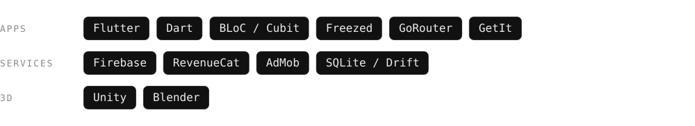
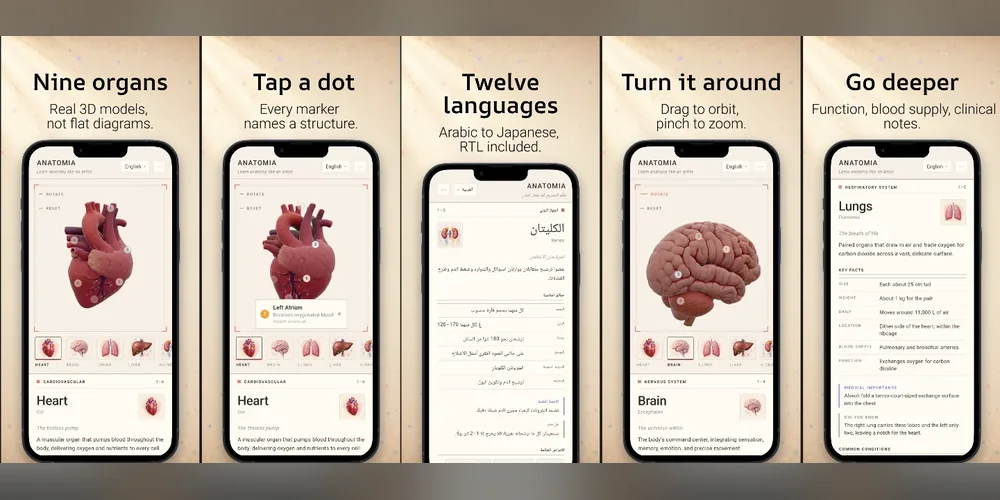
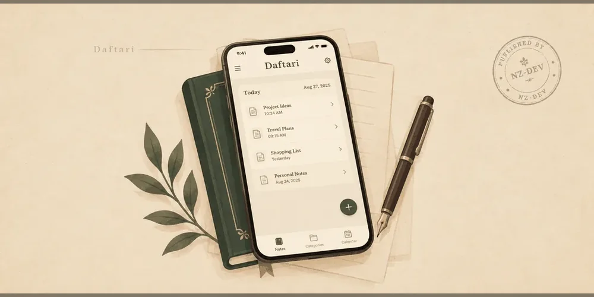
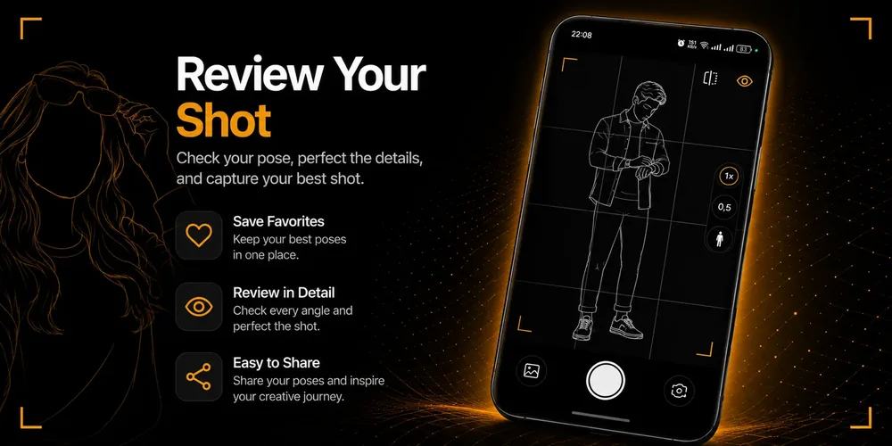
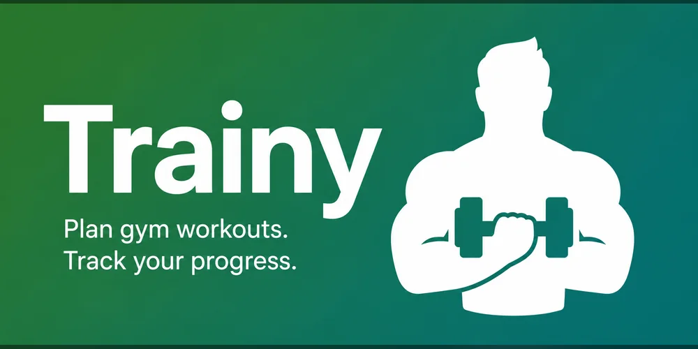
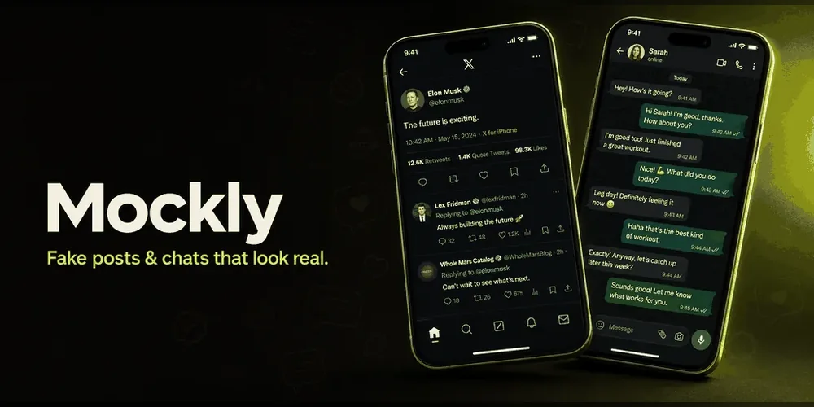
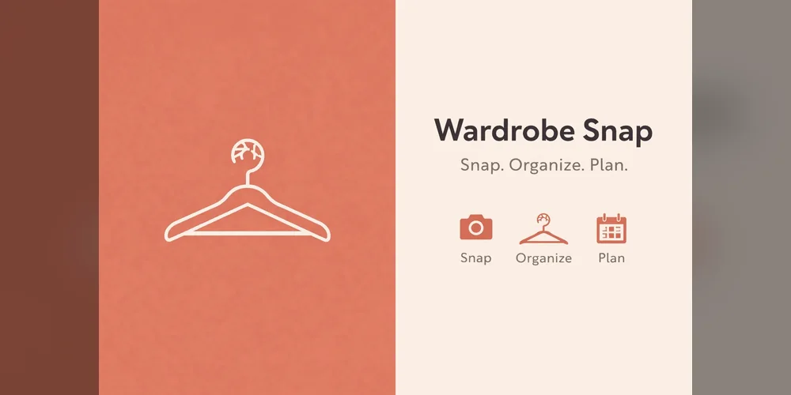

  <a href="https://nizarzitouni.github.io/"><b>Website</b></a> &nbsp;·&nbsp;
  <a href="https://nz-dev.web.app/"><b>NZ-Dev studio</b></a> &nbsp;·&nbsp;
  <a href="https://www.linkedin.com/in/nizar-zitouni"><b>LinkedIn</b></a>

I'm a Flutter developer from Constantine, Algeria. I take mobile apps from idea to store: product, architecture, code, release and monetization. I run my own one-person app studio, [NZ-Dev](https://nz-dev.web.app/): 20+ apps, 200K+ downloads and more than $1K a month in revenue so far.

### Featured apps

<table>
<tr>
<td width="33%" valign="top"> <b>Anatomia</b> Explore 3D human organs, tap labelled structures, and quiz yourself.</td>
<td width="33%" valign="top"> <b>Daftari</b> Offline invoicing for Algerian auto-entrepreneurs, from quote to paid.</td>
<td width="33%" valign="top"> <b>PoseGhost</b> See the pose before you shoot, with a ghost guide right on your camera.</td>
</tr>
<tr>
<td width="33%" valign="top"> <b>Trainy</b> Pick exercises from a visual body map, 999+ moves with animated guides.</td>
<td width="33%" valign="top"> <b>Mockly</b> Create realistic fake social media posts and chat conversations in seconds.</td>
<td width="33%" valign="top"> <b>Wardrobe Snap</b> Snap your clothes, organize a digital closet, and plan outfits.</td>
</tr>
</table>

<a href="https://nizarzitouni.github.io/projects.html">All projects ↗</a>

